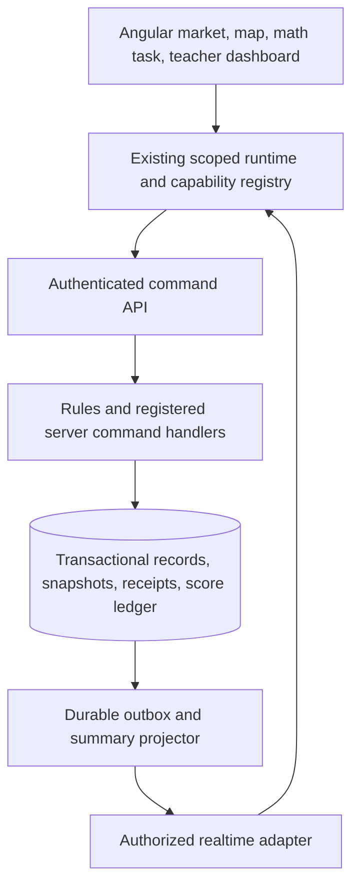

# Frontier Trading Company: living market and timed trading final

**Status:** Design proposal for review; no application implementation authorized by this document.  
**Date:** September 3, 2026.  
**Working activity title:** The Great Trading Company Exchange.  
**Platform recommendation:** Add a reusable, server-authoritative **Live Classroom Session** capability with math challenges, atomic transactions, a shared clock, scheduled events, and live score summaries.

## 1. The experience we want

Students should feel that they are running a company in a world that responds to their decisions. Goods leave shelves, wagons fill, another company posts an offer, a bridge becomes expensive, and a town announces a new need. Every change should have a readable explanation and a record students can inspect.

The central loop is:

**Find an opportunity → calculate → check the terms → agree → trade → see the result → adapt.**

In the final, time makes the decisions exciting. Correct calculations unlock transactions and route decisions. Faster accurate work leaves more time to negotiate, compare offers, complete additional trades, and recover from surprises. Extra transactions are useful when they improve the plan; transaction count alone does not earn points.

Students finish with more than a winning balance: they have receipts, an explanation of a price trap, a revised route or budget, a peer audit, and individual evidence of mathematical understanding.

### Recommended design defaults

| Decision | Proposed default |
| --- | --- |
| Group size | 3–4 students; configurable for the actual roster |
| Lesson length | 60 minutes, including a 30-minute timed trading challenge |
| Interaction | Face-to-face negotiation supported by a shared digital exchange |
| Trading | Goods for simulation money; both companies approve identical terms |
| Math | Short, server-checked tasks tied to the actual transaction or decision |
| Competition | A 100-point company challenge score; speed contributes at most 10 points |
| Cooperation | Two distinct trading partners, a peer audit, and a shared class delivery target |
| Final product | Team evidence and defense plus an individual reflection/assessment |
| Teacher control | Preview, start, pause, release events, inspect receipts, assist, and finalize |
| Initial scope | One class session, a common trading hub, and one delivery journey per company |

These are new final-activity settings. They must not silently change the current practice simulation's starting money, prices, single-route season, or saved progress.

## 2. What exists and what needs to be added

The current simulation already provides market purchases and sales, integer-cent accounting, cargo capacity, seeded trail events, route planning, a ledger, evidence pinning, and a ten-section report. Recent map/market fixes improve planning continuity, previews, controls, and readable consequences.

It currently saves one company snapshot in browser storage, keyed by project and version. Its teacher workspace is explicitly local and unauthenticated. Its simulation persistence interface is synchronous. It does **not** yet provide an authenticated class roster, a shared market, transactions between teams, a server clock, or an authoritative class scoreboard. Two open browsers therefore cannot be treated as two connected companies.

The LMS architecture already calls for scoped runtime state, events/rules/commands, server authority for consequential actions, persistence/realtime adapters, and separate student, team, and class records. The proposed capability should implement those boundaries, not create a second project runtime.

| Reuse or extend | New platform work |
| --- | --- |
| Existing goods, market, route, cargo, money, receipt, and report concepts | Authenticated session membership and company ownership |
| Pure calculations and validation where their assumptions still apply | A transaction service that can commit changes to two companies together |
| Runtime events, registered handlers, and adapter boundaries | Shared clock, quote reservations, server math checking, and event scheduling |
| Existing evidence/report workflows | Live summaries, contribution records, and final-session evidence links |
| Current route/market UI patterns | Offers from other groups, challenge gates, and synchronized state feedback |

An asynchronous server adapter alone will not solve the whole gap: the current synchronous simulation dispatch/load path and single-company reducer also need a deliberate integration with the shared command pipeline.

## 3. Make the market feel alive without making it harder to read

### One clear trading workspace

Keep a stable top strip: **Time left · Cash available · Cargo used · Orders delivered**. Below it, show the selected stall or company, its available offers, and one current trade. The main action should read clearly: “Calculate this trade,” “Waiting for the other company,” or “Review and confirm.”

| Living feature | What students can do | What makes it trustworthy |
| --- | --- | --- |
| Merchant reactions | Ask “What do you need?”, “What changed?”, or “How is this priced?” | Scripted responses use actual scenario state; facts and rumors have different labels |
| Stock on shelves | Buy crates and see the quantity fall | Counts change after the server confirms a transaction; reservations show separately |
| Company stalls | Open another group's posted offer and propose a quantity | Company alias, quantity, unit, price, fee, and availability are visible |
| Town noticeboard | Inspect delivery orders, shortages, and public offers | Each notice has a source, publication time, deadline, and current status |
| Cargo loading | See planned crates settle into the wagon after a purchase | Planned, reserved, and owned cargo are visually distinct |
| Price changes | Compare the new price with the last posted price | Only actual recorded price history produces a trend arrow |
| Transaction celebration | See a brief handoff, receipt stamp, and score explanation | The receipt persists; animation never substitutes for confirmation |

Use a small number of meaningful notifications. A new offer can appear quietly on the board; a route closure deserves an alert. Never let a new notice move the button a student is about to press. No full-screen confetti during another calculation, artificial activity feed, or invented “live” players.

For the first version, structured offer cards and classroom conversation are enough. Free-text chat, auctions, and simultaneous bidding are unnecessary.

## 4. Make the route map an active decision tool

The map should answer: **Where are we? Where can we go? What will the trip cost? What changed?**

- Clicking a destination opens a trip card with supply cost, simulated travel days, cargo demand, constraints, and arrival estimate.
- Selecting a route previews the complete budget, including reserved purchases and known fees.
- Other companies can appear as labeled wagons or town counters using their published stage/location. A list offers the same information without requiring map interaction.
- Checkpoints create actual choices: pay a toll, take a longer road, buy supplies, or recalculate a delivery plan. Passing the associated math gate enables the chosen action.
- A road event changes its symbol and the matching route card together. “Bridge toll added: $6” is more useful than an unexplained red glow.
- Wagon movement follows committed progress. A short transition moves between recorded checkpoints; it does not invent elapsed days or silently advance the simulation.

Use two explicitly labeled concepts: **Challenge time remaining** and **Journey day**. The first is the server-controlled lesson clock. The second is the simulation's route budget. A correct checkpoint response can advance a simulated day without making students wait a real minute watching an animation.

In the first final, companies negotiate at a shared hub and depart once. They can make as many useful, valid trades as time and resources permit before departure. After departure, hub trading is unavailable. A departure review warns about missing order goods, route costs, and remaining time. Returning trips and trading remotely between locations are later extensions.

Keep essential labels stationary, offer keyboard/button equivalents, respect reduced motion, and make effects optional. The scene creates atmosphere; the adjacent numbers explain the decision.

## 5. The 60-minute final activity

### Lesson sequence

| Lesson minutes | Session stage | Student work | Teacher/system work |
| --- | --- | --- | --- |
| 0–5 | Briefing | Read the mission, scoring, and worked sample | Explain prices, units, timer, retries, and help options |
| 5–10 | Planning | Inspect starting goods/orders and assign roles | Confirm readiness; practice a non-scoring trade |
| 10–18 | Timed exchange 1: active minutes 0–8 | Negotiate, calculate, and trade | Start the shared 30-minute clock |
| 18–20 | First surprise: active minutes 8–10 | Recalculate a route or budget | Release the same scheduled market/route event to the class |
| 20–28 | Timed exchange 2: active minutes 10–18 | Adapt, find better offers, and complete orders' shopping lists | Show live progress and help requests |
| 28–30 | Second surprise: active minutes 18–20 | Check a price trap or new opportunity | Release a second bounded challenge |
| 30–40 | Delivery window: active minutes 20–30 | Finish hub trades, depart, solve checkpoints, and deliver | Enforce the deadline; resolve submitted commands consistently |
| 40–48 | Peer audit | Verify another company's receipt and discuss its strategy | Trading stays closed; audit evidence can still be submitted |
| 48–60 | Defense and reflection | Explain one trade, one revision, and one individual calculation | Review provisional scores and collect the final product |

The two surprise windows are part of the 30-minute clock, not extra time. Global pauses stop that clock and all related expiry calculations. The teacher can extend the lesson/session deliberately, with a visible new deadline and audit reason.

### Roles that produce evidence

| Role | Responsibility | Recorded contribution |
| --- | --- | --- |
| Negotiator | Find partners and agree on terms | A submitted offer or confirmation |
| Bookkeeper | Check prices, cash, and receipts | Assigned math responses and receipt checks |
| Cargo manager | Check quantities, capacity, and delivery goods | Cargo calculations and delivery review |
| Navigator | Compare routes and respond to events | Route calculation and revised plan |

Rotate roles after the first surprise. Every student receives assigned math checks; the bookkeeper must not answer every assessed question. The roster determines the distribution for groups of different sizes. A shared-device mode must identify the contributor through a trusted LMS mechanism or teacher attestation; a name dropdown alone is not proof of individual mastery.

### Make other groups necessary

Each company starts with a different specialty and needs goods held by at least two other companies. Delivery orders require those goods. The exchange records both sides of a deal, so a group cannot simply claim it traded with another group.

Add a cooperative class objective: **deliver all participating companies' required orders**. Display delivered/required orders and celebrate the shared result. Keep this class target separate from individual grades and company competition. If a group is absent, the teacher must rebalance before starting rather than leave an impossible target.

### A small, feasible four-company pilot

This is a separate final scenario, not a replacement for current practice prices. It uses four goods, one cargo space per crate, 12 spaces per company, $120 starting cash, and eight specialty crates with a recorded starting value of $10.25 each.

| Company | Starting inventory | Order 1: deliver 4 crates | Order 2: deliver 4 crates |
| --- | --- | --- | --- |
| A | 8 flour | Cloth | Coffee |
| B | 8 cloth | Tools | Flour |
| C | 8 tools | Coffee | Cloth |
| D | 8 coffee | Flour | Tools |

Each completed order pays $60 from an explicitly funded scenario account. At a baseline trade price of $10.25, every company can sell eight crates for $82 and buy its required eight crates for $82. Each good has eight crates supplied and eight required. Each company must buy from two different suppliers. A feasible sequence exists in which companies sell four crates, then buy four, keeping cargo at or below 12 spaces.

One verified sequence, trading four crates at each step, is: A sells flour to B; B sells cloth to A; B sells cloth to C; C sells tools to B; C sells tools to D; D sells coffee to C; D sells coffee to A; A sells flour to D. This sequence reaches all eight order quantities, never exceeds 12 cargo spaces, and never leaves a company with less than $79 cash. It is a teacher feasibility witness, not a required student script.

With a $12 route and both orders delivered, a company ends with $228 cash and no cargo: $120 + $82 − $82 − $12 + $120. Its starting economic value was $202 ($120 cash + $82 cargo), so the gain is **$26**, not $108. This example is a feasibility baseline; negotiated prices and configured alternatives create the actual comparison challenges.

Provide a teacher preview that checks supply, purchasing power, cargo capacity, routes, deadlines, and event effects. Supply totals alone are insufficient: validate a witness sequence of trades and deliveries. For larger classes, use balanced exchange pods or a validated class-wide allocation. Any NPC fallback stock or teacher-supported company must be included in that balance sheet and labeled honestly.

## 6. Math is the action gate

### Student flow

1. Select an offer and quantity. Show units, prices, fees, and relevant stock/cargo facts.
2. The server produces a versioned quote and a short calculation tied to those terms.
3. The assigned student enters the answer and, where required, a short calculation or comparison.
4. A correct response unlocks review. Show the complete equation and before/after cash and cargo.
5. Both companies approve the same terms. When all gates and confirmations are valid, the server commits the trade once.
6. Both companies receive the same transaction ID, their corresponding receipt entries, and updated balances.

The current practice preview calculates totals automatically. In assessment mode, it must withhold the specific answer being assessed until the response is checked, while retaining all inputs needed to solve it. Do not expose that answer in another panel or send a hidden answer key to the browser. Practice mode can continue showing worked previews.

### Challenge types

| Type | Example | What a correct answer unlocks |
| --- | --- | --- |
| Line total | 4 crates × $10.25 | Review a proposed purchase or sale |
| Cash remaining | $100 − $43 including a fee | Confirm an affordable purchase |
| Unit price | $24 for 3 sacks | Compare two offers |
| Total with fee | $41 goods + $2 delivery | Check the final amount payable |
| Profit/margin | $51 revenue − $41 goods − $6 travel | Evaluate a resale opportunity |
| Cargo | 12 spaces − current/reserved load | Commit a load that fits |
| Route budget | 3 days + 2-day detour within a 5-day limit | Choose a feasible route |
| Price comparison | Six sacks from two differently packaged offers | Accept the better fit or reject a poor offer |

Buyers and sellers get complementary checks rather than a single answer that one side enters for both. Most trades should require one short calculation per side; reserve multi-step tasks for defined checkpoints. Tune quantity/price ranges so the activity feels like trading rather than a continuous worksheet.

Use integer cents for money and exact, explicitly scaled arithmetic for other quantities. State the requested unit and rounding rule. Accept equivalent money input such as `41`, `41.0`, and `41.00` when dollars are requested. Bundle size must divide the requested quantity unless a whole-bundle purchase is explicitly selected. Percentage discounts can be an optional extension, not an assumed Grade 5 prerequisite.

### Mistakes, help, and speed

- An incorrect answer produces a useful prompt and leaves money/cargo unchanged. It does not silently execute a trade or impose a surprise fine.
- The same challenge remains active on retry. Refreshing or cancelling does not generate an easier assessed slot.
- A hint explains a step; a worked explanation can be followed by an equivalent fresh check. Record support use and never present supported work as unaided mastery.
- Correct arithmetic can still support a poor business choice. After an explicit review, allow an affordable, feasible poor deal to proceed; the economic consequences create something to discuss.
- Correct answers remove the immediate gate; students still need the other party's agreement and available resources. Say “Ready to confirm,” not “Trade completed.”
- Speed is measured for the assigned math task, excluding session pauses and counterpart waiting. Network or teacher recovery must be visible in the timing record.

Default to a modest speed bonus and natural time savings rather than large time penalties. Calculator/support policy and timing accommodations are set before launch. If a learner needs longer overall trading access, extend the shared session or use an appropriate separate session; do not quietly keep an exclusive market open after everyone else stops. Public ranks should only compare declared comparable profiles. Individual support details stay private.

## 7. Price traps and surprise challenges

Price traps should challenge interpretation of visible terms. They must not rely on hidden charges, unreadable labels, or a changed price after approval. All money is simulation money.

### Worked trap examples

| Trap | Visible offers or facts | Correct reasoning |
| --- | --- | --- |
| Cheap label, added fee | A: 6 sacks at $7.50 plus $6 delivery. B: packs of 3 for $24, no fee. | A costs $51; two B packs cost $48. B saves $3. |
| Low unit price, excess quantity | Need 6 crates. An 8-crate bundle costs $60; single crates cost $8. | The bundle is $7.50 per crate, but six singles cost $48. Extra stock needs cash, space, and a credible use. |
| Revenue mistaken for profit | Sell 4 at $12.75; they cost $10.25 each; travel costs $6. | Revenue is $51, goods cost $41, and profit after travel is $4. |
| Attractive destination, poor trip | A market pays $8 more for the load but requires $12 more in supplies. | The extra trip reduces the outcome by $4 before other risks. |

Some offers can be reasonable for one company and poor for another. Score the calculation and satisfaction of the stated need, not a universal “always buy the cheapest” rule. A correct rejection may be recorded as a decision receipt, separate from a money-moving transaction.

### Event deck for the pilot

| Event | Interactive response | Bound on the surprise |
| --- | --- | --- |
| Bridge toll | Pay $6 or choose a detour adding 2 simulated days | Preview verifies at least one affordable route remains within the scenario day limit |
| Shortage bulletin | Compare a new NPC quote or negotiate with another company | Changes new quotes only; accepted delivery orders retain their terms |
| Freight special | Compare bundle quantities and a delivery fee | All fees and units are visible before any math/confirmation |
| Extra town request | Consider an optional order for remaining stock | Publish only if stock and time make it feasible; do not replace a required order |

Use a small, seeded deck with comparable difficulty, saved once per session. Prefer shared shocks for the first competitive final. Individual route consequences may differ, but the teacher preview must establish comparable opportunity. Do not let an arbitrary random catastrophe decide the winner.

A scheduled price change never rewrites a firm quote already reserved. Either honor the quote until its visible expiry or expire it under an announced rule; changed terms require a new quote, new validation, and fresh approvals. Settled transactions are immutable. Route events apply according to a published cutoff and cannot retroactively charge a completed journey.

## 8. Live scoring and the final grade

Use one explainable company challenge score out of 100. Display its breakdown and the event behind each change. The score can be exciting without turning speed or starting wealth into the entire assessment.

| Category | Maximum | Proposed rule |
| --- | --- | --- |
| Math accuracy | 40 | Eight assigned assessed slots, one from each type above, worth up to 5 points each |
| Required deliveries | 25 | Two required orders, 12.5 points each, accepted before the trading deadline |
| Adaptation and price decisions | 15 | Three named decision checkpoints, up to 5 points each |
| Collaboration and audit | 10 | 3 points per distinct qualifying supplier, capped at two; 4 points for the assigned peer audit |
| Accurate efficiency | 10 | 1.25 points for each assessed slot solved correctly on its first attempt within its configured time |
| **Total** | **100** | Fixed opportunities and explicit caps |

For an assessed math slot: first-attempt unaided success earns 5; second-attempt success earns 4; later success or a hint earns 3; teacher-assisted completion earns 2; incomplete earns 0. Supported slots do not receive the speed bonus. Proposed pilot time allowances are 90 seconds for a simple task and 120 seconds for a multi-step task, adjusted by the declared timing profile and piloted before use.

Assign the eight assessed slots before play and distribute them across team members. Bind each to its first eligible scenario task; the assignment survives cancelled deals and refreshes. If no appropriate trade occurs, provide an equivalent assigned checkpoint so the team still has access to all 40 math points. Additional operational calculations continue to gate trades but do not create unlimited new score slots. Once a slot is completed, repeat work cannot improve its competition points; later learning evidence can still inform teacher review.

The three adaptation checkpoints are: a fee/unit-price comparison, a feasible response to the route event, and an excess-quantity or revised-budget decision. Each awards 3 points for the required correct calculation and 2 for selecting an option that meets explicit scenario constraints. A calculation may also fill its designated math slot; that intentional category overlap is published, not a duplicate event award. Free-text reasoning is saved for teacher review, not automatically judged for quality by a keyword or language model.

A qualifying supplier is a distinct other company whose received goods are used in the team's accepted required orders, traced through inventory lots and receipts. Repeated trades, circular resales, or splitting a single order cannot multiply collaboration points. An audited transfer can retain lot provenance through resale without counting the same delivered quantity twice.

The peer audit awards one point each for correctly checking quantity × price, total including fees, cash change, and cargo change against an assigned transaction. A brief explanation accompanies the checks for teacher review. The actual accounting record remains intact; any intentionally flawed worked example must be labeled as an exercise, not inserted into official receipts.

During trading, audit points remain pending. At the trading deadline, cash/cargo and delivery eligibility close, while the audit stage remains open. Label the score **Provisional** until auditing and review finish. Example: 34 math + 25 deliveries + 10 adaptation + 10 collaboration/audit + 7.5 efficiency = **86.5/100**. Clicking the 7.5 should reveal the six timely, first-attempt slots that earned it.

Show cash, sales revenue, expense, and inventory value separately from challenge points. Never equate cash gain with profit when starting goods were endowed. Define profit consistently as revenue less cost of goods consumed/sold and expenses, or reconcile ending versus starting net worth under the same cost-basis policy. Receiving an order payout consumes its delivery goods once; do not also credit their value as remaining inventory.

The company challenge score is **not automatically the student grade**. Save individual responses, retries/support, contribution evidence, and reflections separately. The final rubric should assess mathematical accuracy, reasoning, evidence, revision, and collaboration. Completion, mastery, submission, teacher approval, and grade remain independent LMS states. A tie can remain a tie; there is no need for a fastest-click tiebreaker.

## 9. The system to add to the LMS

### Recommended architecture

Build a reusable **Live Classroom Session** capability inside the existing runtime, with a server command processor, a transactional relational store, and authenticated realtime delivery. A managed PostgreSQL service is the recommended storage direction for evaluation because the central operation coordinates multiple companies' balances, stock, reservations, receipts, and score records. The production provider remains a separate decision, consistent with the repository's vendor-deferred architecture.

Use a modest backend with clear modules, not a new frontend framework or a collection of microservices. The same capability can later support a classroom resource allocation exercise or another market simulation through configuration and registered evaluators.

The outbox is a durable list of notifications written in the **same transaction** as the official change. A worker can retry delivery after a crash without re-executing the trade. Realtime messages tell browsers what committed; they are not the accounting authority.

### Reusable modules

| Module | Owns |
| --- | --- |
| Session coordinator | Session lifecycle, immutable configuration reference, roster, seed, shared clock, and round rules |
| Exchange command handlers | Offers, firm quotes, reservations, approvals, atomic settlement, expiry, and receipts |
| Math challenge evaluators | Versioned task generation, exact answer checking, assigned contributor, support policy, and gate result |
| Scenario event scheduler | Persisted scheduled events, deterministic release, and validated consequences |
| Score/evidence handlers | Capped awards, unique source references, individual evidence, and final-product links |
| Summary projector and realtime adapter | Small team/class/teacher views, sequence numbers, reconnect recovery |
| Teacher workspace | Authorized commands, readiness checks, assistance, correction records, and final review |

All are proposed platform responsibilities; these names are not claims that corresponding services or registered capabilities already exist.

### Backend options to evaluate

| Direction | Assessment for this use case |
| --- | --- |
| Managed PostgreSQL + authenticated API + realtime adapter | Recommended starting direction; evaluate managed database/realtime products or a small hosted API against the same atomicity and authorization contract |
| Transaction-capable document backend | Possible alternative if already selected by the LMS, but it must prove multi-company atomic settlement, contention handling, bounded reads, and audit exports |
| Browser storage or direct peer-to-peer state | Suitable for local practice/drafts only; does not provide the required authoritative classroom record |

This is a repository-grounded architecture recommendation, not a verified provider comparison. External documentation lookup was unavailable during preparation. No provider, subscription, price, deployment, or vendor SDK is selected here. Validate current provider limits, authentication integration, operations, and load behavior before choosing an adapter.

## 10. Records and boundaries

Every record, command, lookup, uniqueness constraint, subscription, and cache key is tenant-bound. A live attempt additionally carries class, session, project/version, and the relevant team or student scope. Resolve actor identity and membership on the server; never accept a client-supplied role as authority.

| Record | Important fields/content | Read scope |
| --- | --- | --- |
| Session | Configuration version/hash, seed, state, clock, roster version, event schedule | Sanitized class view; full teacher view |
| Company account | Cash, reserved cash, inventory lots, reserved quantities/capacity, state version | Own team and authorized teacher |
| Public offer | Company alias, good, unit, quantity, price/fee, version, expiry, status | Participating session/pod |
| Firm quote | Exact lines/terms hash, parties, reservations, approvals, active-time expiry | Participating parties and teacher |
| Math task/attempt | Task/slot/evaluator version, contributor, response, timing, support, result, quote reference | Student-private assessment detail and teacher; minimum gate status to team |
| Transaction and postings | ID, quote, lines, fees, cash/inventory deltas, lots, before/after versions, server commit time | Parties and teacher; explicitly assigned redacted peer-audit view |
| Delivery | Order version, consumed lots, payout, deadline result, evidence links | Own team and teacher; public completion summary |
| Scenario event | Schedule key, payload/version, release time, resulting command references | Appropriate class/team audience |
| Score award | Category/slot, source event, rules version, points, explanation, correction reference | Own team and teacher; optional public category totals |
| Command result/outbox | Idempotency key, payload hash, outcome, stream sequence, delivery state | Server-only |
| Final evidence/submission | Receipt references, math evidence, revision, peer audit, individual contribution | Existing authorized submission/review scopes |

Use normalized records and indexed access paths rather than one class-sized JSON document. Keep current snapshots for efficient loading alongside meaningful event/receipt history. Retain official receipts and assessment evidence for the configured review period; do not truncate them merely because the visible activity feed is bounded.

Do not broadcast private answers, full balances, private orders, accommodations, or complete student snapshots to the class. Public company position/needs are limited to configured shared information. Teacher dashboards subscribe to summaries and load details on demand.

## 11. Exact transaction lifecycle

### Proposed state machine

**Draft → proposed offer → reserved firm quote → math passed + both approvals → committed.**

Before commitment, a quote can instead be declined, cancelled, or expired. Drafts and public offers do not move money or stock. Editing a firm quote creates a new version and invalidates old approvals/gates where the terms changed.

1. **Propose:** The negotiator submits structured terms. These are not yet a sale.
2. **Reserve:** When both companies are ready to calculate, the server checks available stock, buyer cash, buyer capacity, and session rules. It creates a short-lived reservation against the exact quote. Display the time remaining and amounts held.
3. **Calculate:** Assigned students solve quote-bound tasks. The server retains authoritative pass records tied to actor, team, session, task version, and terms hash. A client `passed: true` is never sufficient.
4. **Approve:** Both sides confirm the same goods, quantities, prices, fees, and delivery rules. Either can decline before settlement.
5. **Settle:** In one short database transaction, lock or otherwise protect the affected records in a stable order; recheck authority, clock, quote version, reservations, gates, and approvals; post both sides; consume the reservation; record receipts/awards and outbox entries; save the command result.
6. **Notify:** Return the committed result and publish the appropriate team/class summaries. Each browser updates confirmed state once using transaction ID and version.

Never hold an open database transaction while children calculate or negotiate. A reservation is a persisted, expiring record. Start with one active firm quote per company and a configurable three-minute active-time hold, adjusted by the session profile. Public offers can remain listed, but the UI must show that the company is busy. Cancellation and expiry release cash, goods, and capacity; a recovery job also cleans up abandoned holds. This bounds accidental hoarding and keeps settlement understandable.

### One complete receipt example

Company A buys four cloth crates from Company B at $10.25 each with a $2 freight fee. A starts with $100 and two cloth crates; B starts with $60 and six. Assume sufficient cargo capacity.

| Posting | Company A | Company B | Scenario freight account |
| --- | --- | --- | --- |
| Goods payment: 4 × $10.25 = $41 | −$41 | +$41 | $0 |
| Freight fee | −$2 | $0 | +$2 |
| Cloth movement | +4 | −4 | 0 |
| Ending cash | **$57** | **$101** | **$2** |
| Ending cloth | **6** | **2** | **0** |

The two companies and freight account still hold $160 in total; cloth still totals eight crates. The buyer's new lot has a $43 acquisition cost including freight. Seller profit depends on the cost basis of the four crates sold, not on the buyer's freight charge. Both receipts reference one canonical transaction ID and identical terms. The example assumes the freight account starts at $0.

Define fee allocation and cost-basis rules in the versioned scenario; preserve integer-cent totals when splitting costs across units. NPC trades, route supplies, starting endowments, and delivery payouts also use explicit source/sink postings so all resource changes are explainable.

### Retry and conflict rules

- Each consequential command has a tenant/session-scoped idempotency key and payload hash. Retrying the same command returns the original result; reusing its key with different content is rejected.
- Expected versions and protected reservations prevent two buyers from spending the same cash or buying the same last crate.
- A concurrent conflict returns a readable outcome and refreshed state. It never silently changes the quantity or charges the student twice.
- Every terminal outcome leaves resources either fully transferred or fully released. No buyer-only success.
- A score award has a unique category/slot/source identity. Replayed notifications cannot award it again.
- Teacher corrections use new, linked compensating records and reasons, not deletion or rewriting of the original receipt. If goods were subsequently consumed or resold, use an explicit adjustment workflow rather than an invalid automatic reversal.

## 12. Clock, live updates, and recovery

### Session lifecycle

**Draft → ready → running ↔ paused → trading closed/settling → audit → teacher review → finalized.**

The authoritative clock stores start/resume references, accumulated active duration, pauses, and authorized extensions. The client renders its countdown from server time and periodically reconciles it. Do not write to the database every second. Quote expiry, event release, and the trading deadline use the same active-time basis so a pause does not consume a student's quote.

For deadline races, the settlement handler checks server active time after obtaining the required concurrency protection. A command that reaches this decision point after closure is rejected, even if a local countdown looked different. A successful transaction records that authoritative decision time and settles once. If the response was lost, retrying returns that result. The “settling” stage reconciles accepted results and expires outstanding holds; it does not allow new late trades. Apply the same policy to required deliveries.

Schedule events with unique session/schedule keys. Repeated scheduler runs cannot release the bridge event twice. When a service recovers after a delay, reconcile persisted clock/state and due events before reopening actions; the teacher may issue an audited pause/extension for an outage.

### What updates live

| View | Update trigger |
| --- | --- |
| Cash and cargo | Committed postings/reservation changes |
| Offers and stock | Offer revision, reservation, expiry, or committed trade |
| Company/map position | Committed route/checkpoint/arrival event |
| Math/gate state | Server-checked response or task/support change |
| Score breakdown | Unique score award or documented correction |
| Class order target | Accepted delivery |
| Teacher dashboard | Projected progress, stuck/pending states, and assistance requests |

Commands use request/response calls; authorized realtime streams deliver confirmed changes. Use the existing realtime adapter contract, with SSE, WebSocket, or a managed transport chosen by deployment needs. Do not introduce separate subscriptions for every card.

Every scoped stream has a sequence/version. On reconnect or a detected gap, load a fresh authorized snapshot or missing bounded changes. Clients ignore duplicate/older versions. Responses and subsequent broadcasts share IDs, so receiving both cannot double-apply a result. Summary lag is labeled and never used to authorize spending.

If the network drops, keep the last confirmed balances readable and preserve drafts. Mark official trading as reconnecting; do not imply that an offline trade or math answer has been accepted. Unsure whether a confirmation succeeded? Show it as pending and reconcile using its original idempotency key. Do not blindly replay a new late trade after the deadline.

Keep role changes, reloads, new tabs, and device changes from resetting the timer, seed, attempts, score, or holds. Teacher pause/resume and corrections use the same authorized command pipeline as student actions.

### Proposed operational acceptance targets

Design for the repository's approximate school scale: 500 students, 1,000 active project memberships, and several hundred concurrent users. As initial load-test targets, exercise 300 connected students, 100 active teams, and bursts of 25 consequential commands per second. Aim for 95% of ordinary command responses within 750 ms and confirmed summary updates within 1.5 seconds under the agreed test conditions. These are proposed targets, not measurements of the current app.

Monitor rejected conflicts, pending commands, projection lag, failed outbox deliveries, and reconciliation failures using IDs and minimal metadata. Avoid copying student responses into general logs. A realtime outage should delay display updates without losing or duplicating committed transactions.

## 13. Teacher setup and final evidence

Before start, the teacher selects the published scenario/version, roster and teams, timing/support profile, event deck, score visibility, and required order set. A readiness screen reports missing members, unsupported capabilities, unbalanced supply, unreachable destinations, and incomplete timing/score settings. Failed readiness checks block launch with a specific explanation.

During the session, a compact dashboard shows company stage, orders, score categories, last confirmed action, and who needs help. It should distinguish “working on math,” “waiting for partner,” “connection issue,” and “no feasible next action.” The teacher can inspect the exact quote/receipt and assist without guessing from a motionless wagon.

After play, prefill the existing report's evidence tray with:

1. A chosen successful transaction and its calculation.
2. A rejected or corrected price trap with the compared totals.
3. A before/after route or budget revision linked to the event.
4. A delivered order and the source receipts for its goods.
5. The peer-audit record.
6. An individual explanation of one decision and what the student would change.

Use the LMS's structured final-product/argument model for the claim, evidence, reasoning, limitations, and individual contribution. The final challenge is one activity supplying evidence; closing its timer does not automatically submit the project or establish mastery. Report drafting, submission, approval, rubric review, and grade remain separate.

## 14. Capability gaps and integration decisions

The following are **TEMPLATE_CAPABILITY_GAP** proposals, not implemented features or changes to accepted architecture specifications.

| Gap | Smallest reusable addition | Why existing behavior is insufficient |
| --- | --- | --- |
| Live session lifecycle | Registered session capability with clock, phases, roster context, and authorized controls | Local practice state has no shared official session |
| Atomic exchange | Registered resource-exchange commands with quote/reservation/settlement contracts | A single-company reducer cannot safely mutate two groups |
| Contextual math gates | Registered exact evaluators and versioned task/result contracts | Existing configured event answers do not bind permission to a changing bilateral quote |
| Scheduled class challenges | Server schedule/event handler with seeded, idempotent release | Browser-local trail events cannot coordinate a whole class |
| Live score and progress | Capped award records plus scoped summary projections | Local results cannot establish class-wide official scores |
| Final-session evidence | Evidence mappings from transactions, attempts, revisions, and audits | Existing reports do not yet collect shared-session records |

Authentication/enrollment and infrastructure adapters are prerequisites, not Frontier-specific exceptions. Start by mapping these gaps onto the existing registries and runtime contracts. Prefer optional capability configuration and new registered commands over breaking core changes. Proposed event names such as `exchange.tradeCommitted`, `mathGate.evaluated`, and `liveSession.paused` must be registered, schema-validated, and versioned before use; they are not existing API promises.

Project configuration should declare goods, locations, illustrations, scenario accounts, orders, event rules, task templates, caps, timing, and report mappings. Trusted platform code supplies the evaluators and transaction handlers. Project packages must not inject arbitrary executable code.

A future implementation must add a session-aware asynchronous command/hydration boundary while retaining local practice mode and existing saves. Never migrate a local practice balance directly into a competitive session as trusted starting state. Create a distinct session attempt pinned to its published definition and scoring/evaluator versions. Browser previews cannot substitute for that official record.

Update the numbered schemas, validators, capability registrations, fixtures, and relevant architecture documents only as part of a reviewed implementation phase. This proposal does not silently amend them. Prove reuse with a second substantially different scenario before describing the new capability as generally validated.

## 15. Implementation order after design approval

| Phase | Deliverable | Exit check |
| --- | --- | --- |
| 1. Scenario and contracts | Publish the pilot scenario, scoring examples, lifecycle, command/event schemas, and evaluator requirements | Feasible trade sequence; exact accounting examples; all gaps mapped to existing architecture |
| 2. Shared authority | Authenticated class/session membership, scoped records, async adapter boundary, shared clock | Two devices join the correct team/session; cross-scope operations fail; practice still works |
| 3. One complete live trade | Quote, reservation, math check, both approvals, atomic settlement, receipt, reconnect | Concurrent/retry tests prove no duplicated money, stock, or score |
| 4. Timed final loop | Scheduled shocks, route checkpoints, orders, score categories, and live summaries | A complete four-company rehearsal can finish within the published rules |
| 5. Teacher and final product | Readiness dashboard, assistance/corrections, audit stage, evidence/report integration | Teacher can explain every score change and review individual evidence |
| 6. Classroom pilot | Accessibility, timing balance, school-scale load, recovery rehearsal, and second-scenario reuse | Observed bottlenecks resolved; caps and tasks calibrated before broader rollout |

Do not begin with decorative multiplayer wagons or a leaderboard disconnected from official transactions. The first working vertical slice should be **two companies making one accurate, auditable trade that appears correctly on both screens**. Once that works under retries and conflicts, the same record can power movement, market reactions, progress, and excitement.

A teacher-recorded face-to-face rehearsal can validate the lesson before backend work. Label it as a rehearsal with manually entered results; it does not demonstrate live synchronization or replace the production transaction system.

## 16. Required verification before classroom release

| Risk | Required scenario and result |
| --- | --- |
| Duplicate submission | Double click, timeout, reload, and retry produce one transaction and one award |
| Overselling/double spending | Two commands compete for the last stock/cash; only the valid reserved settlement succeeds |
| Partial transfer | Failure midway through settlement leaves both accounts unchanged or both fully committed |
| Changed terms | Price/quantity/fee edit invalidates stale approval and math permission |
| Expired quote | Late confirmation fails clearly and releases all holds; pause preserves active-time validity |
| Deadline race | Commands around closure follow the published server decision-time rule |
| Fake client state | Edited cash, score, timestamps, actor IDs, or gate flags cannot authorize a command |
| Privacy | Another tenant, class, team, or unassigned student cannot fetch private records or subscribe to their stream |
| Reconnect/order of delivery | Missing, duplicate, and reordered messages converge to the server snapshot without duplicate effects |
| Server/worker restart | Accepted trades persist; due events and outbox deliveries recover idempotently |
| Score farming | Repeat trades, cancelled quotes, repeated audits, and replayed events cannot exceed category caps |
| Accounting | Cash source/sink postings reconcile; inventory quantities/lots and cost allocations reconcile after delivery and correction |
| Feasibility | Every starting allocation and released required event retains a validated path to the required outcome |
| Instructional validity | Task answers are not leaked by the preview; hints, retries, and individual contributions are represented accurately |
| Accessibility | Full keyboard completion, clear units/status, screen-reader announcements at meaningful moments, reduced motion, and configured timing support |
| Compatibility | Existing practice project saves, route/market behavior, reports, and other projects still work |

## 17. Repository references and document handoff

This proposal follows [Product Architecture Decisions](../build/12_PRODUCT_ARCHITECTURE_DECISIONS.md), [Scale and Persistence](../build/10_SCALE_AND_PERSISTENCE.md), [Data Schemas](../build/03_DATA_SCHEMAS.md), [Core Runtime Engine](../build/06_CORE_RUNTIME_ENGINE.md), and [Rule/State/Event Engine](../build/08_RULE_STATE_EVENT_ENGINE.md).

Current experience and implementation references:

- [Frontier Trading overview](README.md), [route/market audit](ROUTE_MARKET_UX_AUDIT.md), and [completed fixes](ROUTE_MARKET_FIXES.md).
- [Project configuration](../../src/app/projects/frontier-trading/frontier-trading.config.ts).
- [Simulation runtime service](../../src/app/templates/simulation-decision/runtime/simulation-decision-runtime.service.ts).
- [Current local persistence adapter](../../src/app/templates/simulation-decision/runtime/simulation-decision.persistence.ts).
- [Simulation reducer and calculations](../../src/app/templates/simulation-decision/domain/simulation-decision.engine.ts).

**This design task:** adds this proposal and links it from the Frontier Trading documentation index. No application code, dependencies, runtime records, tests, or numbered architecture specifications are changed by this task. Earlier route/market implementation work remains separate. Validation consists of reviewing the proposal against current code/specifications, checking linked repository files, and verifying worked arithmetic and pilot feasibility; no application build is required for these documentation changes.

Validation completed: all relative document links resolve; the eight-trade pilot sequence meets stock, cash, capacity, and delivery constraints; lesson/timed-stage durations reconcile; receipt balances, trap examples, final profit, and the 100-point scoring examples check out. These are document/scenario checks, not tests of an implemented live backend.

**Next decision:** review the proposed lesson/scoring defaults and approve a first implementation phase. The recommended first implementation scope is the session/transaction contracts and a two-company trade, followed by the full four-company final. Backend provider selection belongs to that implementation preparation, not this document-only task.
