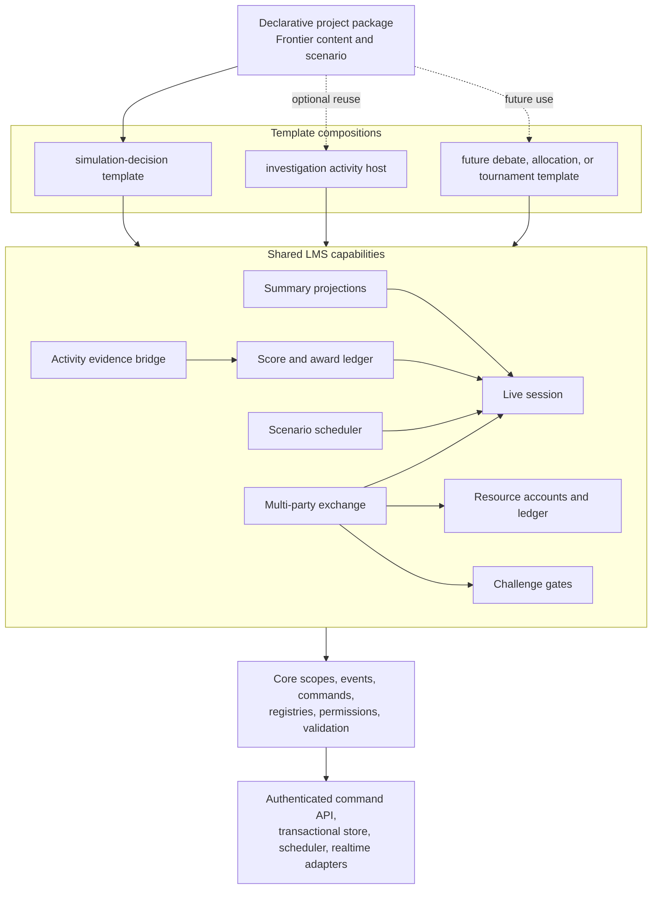

# Reusable live activity architecture proposal

**Status:** Capability boundaries approved; contract, scope, package, and template-registration slice implemented. The live authoritative runtime remains future work.  
**Date:** September 3, 2026.  
**Experience source:** [The Great Trading Company Exchange](LIVE_TRADING_FINAL_DESIGN.md).  
**Decision:** Implement the final as a composition of small shared capabilities hosted by the existing `simulation-decision` template. Do not create a Frontier-specific multiplayer runtime, and do not turn `Live Classroom Session` into one monolithic feature that owns trading, assessment, scoring, and presentation.

## 1. Purpose

The experience proposal defines a strong classroom activity: a timed shared session, bilateral trades, contextual math checks, scheduled surprises, auditable scoring, and evidence for a final defense. This document answers the technical questions that follow:

- Where does each behavior belong in the current LMS architecture?
- Which existing code can be reused, adapted, or must remain practice-only?
- Which capabilities should be reusable by other templates and projects?
- How can the current browser-local simulation migrate without breaking saved practice work?
- What is the smallest credible implementation path?

This proposal refines the architecture sections of the experience design. It does not replace that document's lesson flow, pilot scenario, scoring examples, transaction rules, or accessibility requirements.

## 2. Repository findings

### 2.1 What is already a useful reusable template

Frontier Trading is correctly separated into:

- project content in `src/app/projects/frontier-trading/frontier-trading.config.ts`;
- a project-neutral `simulation-decision` domain model and reducer;
- a project-neutral runtime service and persistence token;
- reusable market, route, cargo, event, ledger, result, report, and teacher pages;
- a thin Frontier route composition.

The current engine already provides useful pure or mostly pure behavior for integer-cent money, market prices, cargo limits, FIFO acquisition lots, route validation, seeded event selection, ledger reconciliation, and report readiness. The UI already provides reusable interaction and accessibility patterns.

### 2.2 Transitional gaps that matter for live use

The current template is reusable at the Angular feature level, but it is not yet integrated with the platform runtime described by the numbered architecture documents.

| Current implementation                                                                       | Consequence for the proposed final                                                                                                                      |
| -------------------------------------------------------------------------------------------- | ------------------------------------------------------------------------------------------------------------------------------------------------------- |
| Frontier config is a TypeScript object imported by the route                                 | A curriculum package cannot select and validate the experience declaratively                                                                            |
| Only the Investigation template is registered in `TemplateRegistry`                          | `simulation-decision` cannot yet be resolved through the common template/package path                                                                   |
| `SimulationDecisionPersistenceAdapter` is synchronous and keyed only by project/version      | It cannot distinguish tenant, class, team, student, or live attempt, and cannot represent pending server confirmation                                   |
| `SimulationDecisionRuntimeService` calls one local reducer and saves a whole snapshot        | It bypasses the core event, registered-command, scoped-mutation, idempotency, and structured-error pipeline                                             |
| `SimulationDecisionState` is a single company's state                                        | It cannot atomically transfer value between two companies or publish safe class summaries                                                               |
| `trade.committed` immediately changes local cash and cargo                                   | This is valid for practice, but cannot be trusted as an official bilateral transaction                                                                  |
| Local teacher actions mutate the same browser state                                          | They are preview tools, not authenticated or audited classroom controls                                                                                 |
| Math answers can exist in student-delivered configuration                                    | That is appropriate for worked practice, but not for protected official assessment keys                                                                 |
| Core `RuntimeEngine` applies one scoped snapshot per dispatch                                | Ordinary scoped mutations fit; a multi-party settlement needs a separate authoritative operation boundary rather than pretending one snapshot is enough |
| `serverRequired` handlers are classified but no production command delegation adapter exists | The platform has the correct marker, but not yet the official execution path needed by the final                                                        |

These are expected implementation-stage gaps. They do not justify a second LMS runtime or a project-specific backend.

## 3. Target composition

The live final should be assembled at four levels.



The dependency direction remains:

```text
project configuration
  -> template composition
  -> shared capabilities
  -> core contracts and engines
  -> infrastructure adapters
```

Infrastructure implements contracts owned above it. Shared modules must not import Frontier Trading, Angular pages, or a database SDK.

## 4. Module boundaries

`Live Classroom Session` should remain a narrow coordination capability. The other behaviors are separate capabilities that can be installed and composed independently.

| Capability ID            | Owns                                                                                                                                   | Does not own                                                     | Example reuse                                         |
| ------------------------ | -------------------------------------------------------------------------------------------------------------------------------------- | ---------------------------------------------------------------- | ----------------------------------------------------- |
| `liveSession`            | Attempt identity, lifecycle, roster/team references, active-time clock, stages, pause/extend/finalize controls                         | Goods, prices, math content, score formulas, template navigation | Timed debate, design sprint, tournament round         |
| `resourceAccounts`       | Typed quantities, available/reserved balances, double-entry-style postings, lots, source/sink accounts, reconciliation                 | Offer negotiation or market presentation                         | Shared lab budget, energy allocation, supply planning |
| `multiPartyExchange`     | Offers, term versions, firm quotes, reservations, approvals, expiry, atomic settlement, receipts                                       | Subject-specific goods or scoring policy                         | Carbon-credit market, classroom resource exchange     |
| `challengeGates`         | Versioned task instances, protected evaluators, attempts, hints/support, contributor assignment, expiring grants bound to a terms hash | Automatic prose grading or business decisions                    | Lab safety check, engineering calculation gate        |
| `scenarioScheduler`      | Seeded/persisted schedule entries, once-only release, pause-aware due times, recovery                                                  | Browser timers or arbitrary executable project code              | Shared document release, timed case development       |
| `awardLedger`            | Capped award slots, source uniqueness, explanations, corrections, provisional/final status                                             | Official grade or free-text judgment                             | Tournament points, collaboration milestones           |
| `activityEvidenceBridge` | Stable references from receipts, attempts, decisions, audits, and revisions to activity results/final products                         | Copies of mutable source records                                 | Investigation evidence tray, design defense packet    |
| `summaryProjection`      | Small authorized team/class/teacher read models with sequence/version and rebuild rules                                                | Authority for spending or settlement                             | Teacher dashboard and class progress displays         |

### 4.1 Why `resourceAccounts` is separate from `multiPartyExchange`

Trading is one use of constrained resources. The platform also needs limited-resource spending, payouts, route costs, lab credits, and future allocation exercises. A generic account and posting layer prevents each template from inventing different balance, reservation, idempotency, and reconciliation rules.

The account layer should support configured units such as cents, whole crates, minutes, credits, points, or fixed-scale quantities. It must not assume every resource is money. Exchange builds bilateral/multi-party terms on top of those accounts.

### 4.2 Why challenge gates are grants, not booleans

A stored `passed: true` flag is too weak. A reusable gate grant should identify:

- the evaluator and evaluator version;
- the task instance and assigned contributor;
- the protected subject/terms hash it authorizes;
- issue and expiry times measured against session active time;
- attempt/support metadata;
- the exact permission it grants, such as `quote.approve` or `route.commit`.

Changing the quote, route, fee, quantity, or evaluator version invalidates the grant. This makes the same mechanism reusable for any consequential action whose inputs can change.

### 4.3 Why awards are not grades

The award ledger is an explainable competition/readiness record. The existing LMS educational states remain separate:

```text
activity completion != mastery != submission != approval != rubric result != grade
```

An activity result may reference awards and attempts, but a teacher or configured assessment workflow determines the grade.

## 5. Fit within each template

### 5.1 `simulation-decision`

This is the primary host for Frontier Trading. The template continues to own the decision-simulation flow and visual workspaces:

- company setup;
- market and offer presentation;
- route/map decisions;
- cargo visualization;
- event choice presentation;
- ledger/result/report views.

When `liveSession` is absent, the template runs its existing local practice mode. When the live capabilities are configured, the same shell renders confirmed shared read models and sends meaningful intents through the authoritative command gateway.

The template must not implement settlement, clock authority, protected answer checking, or score uniqueness inside Angular components.

### 5.2 `investigation`

The live experience can be embedded as a registered activity plugin rather than copied into Investigation code:

```json
{
  "id": "act-live-allocation",
  "type": "simulation",
  "plugin": "live-decision-activity",
  "extensions": {
    "liveActivity": {
      "scenarioRef": "scenario-water-allocation@1.0.0",
      "resultMappingId": "allocation-evidence-v1"
    }
  }
}
```

The plugin joins the configured session, uses shared capabilities, and returns a bounded `ActivityResult` containing completion state and stable evidence references. Investigation remains unaware of quotes, reservations, or trading screens.

### 5.3 Future templates

Templates compose only what they need:

| Future project                     | Reused capabilities                                     | Template-specific presentation/configuration  |
| ---------------------------------- | ------------------------------------------------------- | --------------------------------------------- |
| Water-allocation policy simulation | Session, accounts, exchange, gates, awards, projections | Reservoirs, stakeholder roles, policy choices |
| Engineering design sprint          | Session, scheduler, gates, awards, evidence bridge      | Prototype stages, test data, design review    |
| Historical negotiation/debate      | Session, scheduler, awards, evidence bridge             | Positions, source packets, speaking rounds    |
| Classroom tournament               | Session, scheduler, awards, projections                 | Match rules and bracket renderer              |

This is the required reuse test: capabilities should survive changes in subject, metaphor, and UI. The Frontier scenario alone proves configurability, not generality.

## 6. Declarative package design

`simulation-decision` should gain its own template registration, package descriptor, assembler, definition graph, validators, and compatibility tests. The current TypeScript config can remain as a transitional fixture while the package path is built.

A proposed package is:

```text
frontier-trading-company/
|-- project.json
|-- simulation.json
|-- markets.json
|-- routes.json
|-- events.json
|-- reports.json
|-- live-session.json       # optional capability
|-- accounts.json           # optional capability
|-- exchange.json           # optional capability
|-- challenge-gates.json    # optional capability
|-- scoring.json            # optional capability
|-- evidence-mappings.json  # optional capability
|-- content/
`-- assets/
```

Optional files are loaded only when their capabilities are declared. Missing required capability files or registrations produce structured validation issues. No placeholder files are required.

The assembled `SimulationDecisionDefinitionGraph` should expose immutable indexes and definitions. Angular components and handlers consume the graph; they do not repeatedly parse package files.

### 6.1 Project configuration versus trusted code

Project packages may configure:

- labels, goods/resources, units, locations, routes, offers, starting allocations, and orders;
- session stages, active duration, quote hold duration, and role labels;
- evaluator IDs and safe parameter ranges;
- scheduled event definitions and seeded decks;
- award categories, slots, caps, and evidence mappings;
- student-safe content and assets.

Trusted platform modules own:

- evaluator algorithms and protected answer keys;
- authorization and membership checks;
- atomic settlement and reservation enforcement;
- clock and deadline decisions;
- idempotency, uniqueness, corrections, and audit behavior;
- projection and private-data filtering.

Packages never supply executable TypeScript/JavaScript or override core authority semantics.

## 7. Runtime and authority design

### 7.1 Add live attempt identity without replacing the runtime

The existing `RuntimeScope` distinguishes tenant, project/version, class, student, team, and scope type, but it cannot distinguish two official attempts of the same project in the same class. Add an optional, backwards-compatible `attemptId` (or a consistently named `sessionAttemptId`) to project context, runtime scope, persistence keys, realtime channels, idempotency keys, assets, events, and traces.

This is a proposed core contract change and must be reviewed with schema/specification updates and compatibility tests. Do not hide attempt identity only inside a capability payload because that permits cache and persistence collisions.

Practice mode may omit `attemptId`. Official live mode requires a server-issued attempt ID pinned to the published project, template, scenario, evaluator, and scoring versions.

### 7.2 Introduce an authoritative command gateway

The existing core engine is suitable for deterministic work inside one scoped snapshot. It should not be expanded into a database transaction manager. Add a small platform contract for commands marked `serverRequired`:

```ts
interface AuthoritativeCommandGateway {
  execute(request: AuthoritativeCommandRequest): Promise<AuthoritativeCommandResult>;
  reconcile(operationId: string): Promise<AuthoritativeCommandResult>;
}

interface AuthoritativeCommandRequest {
  attemptId: string;
  scope: RuntimeScope;
  command: RuntimeCommand;
  idempotencyKey: string;
  expectedVersions?: Readonly<Record<string, number>>;
}

interface AuthoritativeCommandResult {
  operationId: string;
  status: 'accepted' | 'rejected' | 'pending';
  committedEventIds?: readonly string[];
  affectedVersions?: Readonly<Record<string, number>>;
  errors?: readonly RuntimeError[];
}
```

The authenticated server resolves the actor and verifies all supplied scope identifiers; client fields never grant membership or role. A capability-owned server handler may coordinate multiple bounded records in one transaction, then emit registered events/outbox messages for each affected authorized view.

In official mode, a `serverRequired` command must not also mutate the local snapshot as confirmed. Local practice may use a clearly named mock authority implementation.

### 7.3 Use bounded records, not one class snapshot

The official activity should use separate records/aggregates for:

- session lifecycle and schedule;
- each team/company account snapshot;
- public offers;
- firm quotes and reservations;
- protected tasks and attempts;
- canonical transactions/postings and receipts;
- deliveries;
- award records;
- evidence references;
- team/class/teacher summary projections.

The transaction handler locks or protects only the records required for that operation in a stable order. The class dashboard reads summaries and never becomes the authority for balances.

### 7.4 Commands, events, and conditions

Use registered, versioned names. Requests describe intent; completion events describe accepted facts.

| Intent command                   | Accepted event               | Typical consumers                          |
| -------------------------------- | ---------------------------- | ------------------------------------------ |
| `liveSession.start`              | `liveSession.started`        | Clock view, scheduler, summaries           |
| `liveSession.pause`              | `liveSession.paused`         | Clock, quote expiry, UI status             |
| `exchange.reserveQuote`          | `exchange.quoteReserved`     | Parties, challenge gates, offer projection |
| `challenge.submitAttempt`        | `challenge.attemptEvaluated` | Gate state, evidence, awards               |
| `exchange.approveQuote`          | `exchange.quoteApproved`     | Settlement handler, party views            |
| `exchange.settleQuote`           | `exchange.tradeCommitted`    | Accounts, receipts, summaries, awards      |
| `scenario.releaseScheduledEvent` | `scenario.eventReleased`     | Rules and authorized class/team views      |
| `delivery.commit`                | `delivery.accepted`          | Accounts, order target, evidence, awards   |
| `award.apply`                    | `award.recorded`             | Score projection and evidence              |
| `teacher.applyCorrection`        | `teacher.correctionRecorded` | Accounts/awards, audit, summaries          |

Rules may react to committed events, but they do not authorize the high-stakes operation that produced them. For example, `exchange.tradeCommitted` may trigger an evidence reference or a capped award; a client-side rule match cannot settle a trade.

Useful reusable conditions include:

- `liveSession.stageIs`;
- `liveSession.activeTimeBefore`;
- `challenge.grantValid`;
- `account.availableAtLeast`;
- `exchange.partnerCountAtLeast`;
- `award.slotStatus`;
- `delivery.status`.

## 8. Template-facing runtime facade

Do not immediately rewrite every simulation page. Preserve `SimulationDecisionRuntimeService` as an Angular facade, but move authority and hydration behind injected ports.

```text
Simulation pages
  -> SimulationDecisionRuntimeService (view-model facade)
      -> PracticeSimulationGateway
           -> existing reducer + core-compatible local persistence adapter
      OR
      -> LiveSimulationGateway
           -> AuthoritativeCommandGateway + scoped RealtimeAdapter
```

The facade exposes:

- confirmed read models as signals;
- local drafts/planning separately from confirmed state;
- pending operation IDs and recoverable structured errors;
- one command method per meaningful intent;
- reconnect and snapshot hydration;
- no database/provider types.

The existing `SimulationPlanning` state remains local and untrusted until a reviewed command is accepted. Market/route animations react to confirmed event/version changes, not button clicks alone.

### 8.1 Practice compatibility

The existing practice experience remains available and browser-local during migration. Preserve its storage key and state contract or provide an explicit tested migration. Never reinterpret an old practice snapshot as an official session account.

The UI must label modes clearly:

- **Practice - saved on this device**;
- **Live session - pending confirmation**;
- **Live session - confirmed**;
- **Reconnecting - last confirmed state shown**.

## 9. Proposed repository layout

Names may change during implementation review, but ownership should remain visible.

```text
src/app/
|-- core/
|   |-- authority/
|   |   `-- authoritative-command-gateway.ts
|   `-- state/
|       `-- runtime-scope.ts                 # attempt-aware keying
|-- shared/
|   |-- live-session/
|   |-- resource-accounts/
|   |-- exchange/
|   |-- challenge-gates/
|   |-- scenario-scheduler/
|   |-- awards/
|   |-- activity-evidence/
|   `-- projections/
|-- templates/
|   |-- simulation-decision/
|   |   |-- package/
|   |   |-- domain/
|   |   |-- runtime/
|   |   `-- ui/
|   `-- investigation/
|-- plugins/
|   |-- activities/live-decision-activity/
|   `-- challenge-evaluators/exact-arithmetic/
`-- infrastructure/
    |-- authority/
    |-- persistence/
    |-- realtime/
    `-- scheduling/
```

Most shared modules should contain framework-independent contracts, validators, registrations, and pure domain functions. Angular renderers belong in a module's `ui` subfolder or template UI; provider-specific implementations remain in infrastructure.

## 10. Reuse disposition for current code

| Current area                                                         | Disposition                   | Required change                                                                         |
| -------------------------------------------------------------------- | ----------------------------- | --------------------------------------------------------------------------------------- |
| `money.ts`, basis-point and exact integer calculations               | Reuse/extract                 | Move broadly reusable fixed-scale math only when a second consumer exists               |
| FIFO acquisition lots and ledger reconciliation                      | Adapt into `resourceAccounts` | Remove single-company assumptions; add postings, reservations, and source/sink accounts |
| Seeded random selection                                              | Reuse behind scheduler        | Store assignment/release once by attempt and schedule key                               |
| Route/market/cargo visual components                                 | Reuse                         | Bind to facade read models and confirmed/pending distinctions                           |
| Strategy report/evidence tray                                        | Reuse and bridge              | Store stable source references rather than copied transaction data                      |
| Local simulation reducer                                             | Keep for practice             | Do not use it as official cross-team authority                                          |
| Browser simulation persistence                                       | Keep as compatibility adapter | Conform to async scoped persistence or wrap it behind the template gateway              |
| Core registries, structured errors, rules, commands, state mutations | Reuse                         | Register live capability packs and validators                                           |
| Core persistence/realtime interfaces                                 | Extend minimally              | Add attempt-aware keys and delta/envelope semantics only where proven necessary         |
| Investigation `ActivityPlugin`/`ActivityResult`                      | Reuse                         | Add one registered bridge plugin; do not import simulation internals into Investigation |

Do not move template-specific market or route concepts into core. Do not move Frontier nouns, prices, role text, or scoring rules into shared capability code.

## 11. Implementation phases

### Phase 0 - Approve contracts and module boundaries

Deliver:

- stable capability IDs and dependency rules;
- live attempt identity decision;
- authoritative gateway request/result contract;
- command/event/error catalog;
- project package examples and protected-content split;
- two non-Frontier reuse sketches.

Exit check: every proposed field has one owner, and no module depends on Frontier content or a backend vendor.

### Phase 1 - Bring `simulation-decision` onto the platform composition path

Deliver:

- `simulation-decision` template registration;
- package descriptor, assembler, definition graph, validators, and fixtures;
- an async, scoped local persistence adapter/facade;
- structured errors and clock injection for deterministic tests;
- compatibility for existing Frontier practice saves and route.

Exit check: Frontier practice loads through the registered template/package path without behavior regression. No live backend is required yet.

### Phase 2 - Build the narrow shared foundation

Deliver:

- `liveSession`, `resourceAccounts`, and authoritative gateway contracts;
- local/in-memory reference implementations;
- lifecycle, active-time clock, account, reservation, posting, idempotency, and reconciliation tests;
- explicit behavior for `serverRequired` commands in local versus official modes.

Exit check: tests prove attempt isolation, pause-aware time, one-time commands, and balanced postings.

### Phase 3 - One complete two-company trade

Deliver:

- exchange quote/reservation/approval/settlement handlers;
- exact-arithmetic challenge evaluator and quote-bound grants;
- transactional persistence implementation behind the gateway;
- receipt/evidence references and authorized realtime updates;
- a minimal live market panel using the existing simulation facade.

Exit check: two devices complete one trade; retries, stale terms, expiry, concurrent spending, and reconnect produce one correct canonical result.

### Phase 4 - Session loop and classroom projections

Deliver:

- schedule/events, order delivery, award ledger, summaries, and teacher readiness views;
- the complete four-company pilot configuration;
- pause/extension/outage recovery;
- accessibility and operational load checks.

Exit check: the documented 60-minute flow can run with safe summaries and explainable provisional scoring.

### Phase 5 - Evidence, final product, and reuse proof

Deliver:

- stable evidence mapping into the current report/final-product flow;
- individual contribution records and peer audit;
- one substantially different project using the same shared capabilities;
- reuse audit documenting unchanged, extended, and new modules.

Exit check: the second project changes configuration and template presentation, not settlement, session, gate, award, or projection engines.

## 12. Validation and release gates

Each reusable capability requires:

- versioned configuration and registration;
- schema, reference, capability, and logic validation;
- pure domain tests and adapter contract tests;
- permission and cross-tenant/cross-attempt isolation tests;
- idempotency, conflict, retry, expiry, and restart tests where applicable;
- structured errors with recoverability guidance;
- accessible keyboard/non-drag UI behavior;
- documentation and at least one fixture.

The integrated vertical slice must test:

```text
student intent
  -> registered server-required command
  -> authenticated authoritative handler
  -> protected evaluator/transaction
  -> atomic records plus outbox
  -> scoped confirmed event
  -> facade hydration
  -> UI and evidence/summary update
```

The release risks and arithmetic/feasibility checks in the experience design remain required. In addition, verify old practice saves, Investigation projects, and the local template registry continue to work.

## 13. Decisions and rejected shortcuts

| Decision                                                               | Reason                                                                                         |
| ---------------------------------------------------------------------- | ---------------------------------------------------------------------------------------------- |
| Keep one LMS runtime with an authoritative operation seam              | Matches the accepted product boundary and avoids a separate multiplayer application            |
| Keep live session narrow and compose other capabilities                | Allows schedules, gates, scores, and accounts to be reused independently                       |
| Keep `simulation-decision` as the primary template host                | Market/route/cargo/report presentation already belongs there                                   |
| Use an Investigation activity plugin for cross-template embedding      | Preserves Investigation's generic Activity contract and avoids imports of simulation internals |
| Preserve local reducer/persistence for practice during migration       | Avoids breaking current users while official mode is built correctly                           |
| Use stable references for evidence and summaries                       | Prevents stale copies and lets source records remain canonical                                 |
| Do not add live fields directly to the monolithic Frontier config only | That would make the next project copy Frontier's assumptions                                   |
| Do not stretch one scoped snapshot across a two-company transaction    | Atomic settlement crosses bounded records and needs an authoritative transaction handler       |
| Do not treat realtime delivery as authority                            | Realtime reports committed results; it does not decide or execute them                         |
| Do not expose answer keys in student packages                          | Official evaluators and sensitive assessment data require protected server paths               |

## 14. Capability gaps requiring approval

```text
TEMPLATE_CAPABILITY_GAP

Requested:
Run multiple official attempts of the same project for a class.

Reason:
RuntimeScope and persistence keys do not currently include live attempt identity.

Suggested reusable capability:
Add an optional attempt/session-attempt identity to core context, scopes, keys,
events, channels, idempotency, and traces with backwards-compatibility tests.
```

```text
TEMPLATE_CAPABILITY_GAP

Requested:
Execute server-required and multi-record operations through the common runtime.

Reason:
The current command executor classifies server-required handlers but has no
authoritative delegation/result contract, and RuntimeEngine processes one scoped
snapshot per dispatch.

Suggested reusable capability:
Add an AuthoritativeCommandGateway and registered trusted operation handlers;
keep normal scoped mutations in RuntimeEngine and coordinate multi-record atomic
work behind the gateway.
```

```text
TEMPLATE_CAPABILITY_GAP

Requested:
Load `simulation-decision` projects from versioned declarative packages.

Reason:
The template is route-composed from a TypeScript object and is not registered in
TemplateRegistry or backed by a package assembler/definition graph.

Suggested reusable capability:
Register the template and add its package descriptor, graph, validators, fixtures,
and local runtime composition before adding official live behavior.
```

## 15. Implementation status and next decision

The approved Phase 0 and package-registration slice now includes:

- shared versioned contracts for all eight live activity capabilities;
- future-status capability registrations that cannot be mistaken for installed implementations;
- the `AuthoritativeCommandGateway` contract;
- attempt-aware runtime scopes, keys, events, context, and tracing;
- `simulation-decision` template registration;
- a declarative package descriptor, immutable graph, assembler, validators, and fixture;
- tests for registration, reference validation, future-capability rejection, and attempt isolation.

The current Frontier Angular route still uses its transitional TypeScript config and local runtime. Moving that route onto the package-loaded facade is the remaining half of Phase 1 and should be performed separately with explicit practice-save compatibility tests.

The first live implementation should still be the smallest vertical slice from the experience proposal: **two companies complete one quote-bound, math-gated, atomic trade and see the same canonical receipt**. The difference is that the slice will be built from reusable session, account, exchange, gate, evidence, and projection contracts instead of being embedded in Frontier-specific code.
