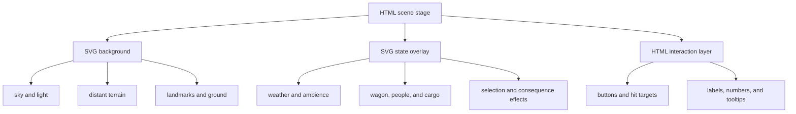

# SVG scene and animation plan

September 3, 2026. Scope: visual art and motion for the existing Frontier Trading Company experience. This is an implementation plan; it does not change simulation rules, records, scoring, or student progress.

## Implementation status

The first complete visual upgrade is implemented. Company Setup, Trading Post, Wagon Load, Route Atlas, active/empty Journey, and Trail Events now use the layered SVG approach in this document. A reusable illustrated wagon supplies consistent canvas, timber, iron, wheel, cargo, load, strain, and movement states across those screens. The journal, results, and report retain their quieter paper-and-record presentation.

The production build passes. Browser review covered setup, market exploration, confirmed purchasing, empty and loaded cargo, route selection, a river-crossing event, active travel, and a 390 × 844 journey layout. Reduced-motion rules stop ambient and command animations while retaining final visual states. The market and event styles remain above the project's advisory 14 kB component-style warning threshold but below its production error ceiling.

## Direction

The game should look like a richly illustrated historical strategy board rather than a collection of decorated web cards. The target is **believable illustration**, not photorealism: recognizable proportions, layered distance, consistent light, material texture, and motion caused by something in the world.

Use inline SVG for the scene art because it can scale cleanly, inherit the existing theme, expose individual layers to Angular state, and remain dependency-free. Keep exact prices, instructions, calculations, controls, and tables in semantic HTML above or beside the art.

The visual promise is:

- the same wagon looks and behaves consistently in the market, cargo yard, route map, journey, and event scenes;
- every location feels like part of one connected landscape;
- motion explains selection, loading, travel, weather, risk, or consequences;
- important numbers stay still and easy to audit;
- students can switch off ambient motion without losing information.

## Current visual audit

| Area | What already works | What holds it back | Recommended role for SVG |
| --- | --- | --- | --- |
| Trading Post | Clear storefront choices, good mission highlighting, visible merchant state, strong parchment/wood palette | CSS rectangles, awnings, emoji goods, and repeating-gradient hills make the market read as cards placed on a backdrop | One location scene behind four HTML/SVG storefront hit areas; illustrated buildings, boardwalk, people, barrels, animals, and location landmarks |
| Shopping-plan wagon | Cargo is linked to the trade draft and visibly reacts to success/failure | Wagon is a rounded box with two CSS circles, so loading lacks physical weight or scale | Compact wagon SVG shared with Cargo; animate crates into or out of fixed cargo slots |
| Cargo | Official table is excellent and the capacity calculation is prominent | Empty state has no wagon; loaded state is a large curved box, package icons are generic, wheels rotate while parked | Full side/three-quarter wagon in a post yard, visible chassis and suspension, cargo silhouettes, ropes, canvas, shadows, and load-dependent ride height |
| Route Atlas | Best existing art; already has terrain, river, settlements, trail states, zoom/pan, wagon progress, reduced motion, and semantic nodes | Oversized labels compete with routes; repeated pulses and moving dashes make the map busy; terrain has limited depth; node and wagon symbols feel icon-like | Preserve the component and redraw its internal layers: richer static terrain below, quieter state overlays above, HTML details outside the map |
| Journey | Controls and event log are clear | Active travel is represented by a progress bar and a symbol; empty journey is mostly blank | A route-dependent horizon scene with the wagon on trail; advance action moves the world and reveals checkpoints without running a continuous animation |
| Trail event | Choice math and consequence records are strong | CSS clouds, gradient rain, lightning character, emoji event, and square wagon feel like placeholders | Reusable event scene with environment variants and state overlays for storm, crossing, breakdown, shortage, camp, or opportunity |
| Ledger and report | Paper metaphor, tables, evidence, and short entry/stamp animations support auditability | Extra scenery would compete with reading and record verification | Keep as HTML. Limit SVG to seals, small map thumbnails, evidence pins, and optional section dividers |

## Art style

### Visual language

- **Camera:** three-quarter view for markets and wagons; elevated illustrated-map view for routes; side view for active travel.
- **Shape:** clean, slightly irregular silhouettes with medium detail. Avoid perfect CSS geometry in world objects.
- **Line:** dark umber outlines at reduced opacity, with thicker foreground lines and thinner distant lines.
- **Light:** warm upper-left key light. Shadows fall down and right in every scene.
- **Depth:** desaturated distant sky and terrain, medium-saturation buildings, and highest contrast on the selected object.
- **Materials:** wood grain strokes, canvas seams, iron rims, packed-earth paths, water highlights, smoke with soft opacity, and parchment only in interface panels.
- **People:** small working silhouettes and simple portraits. They provide scale and activity without becoming detailed character animation.
- **History:** signs, goods, tools, transport, posts, and routes should use one researched period and place. The final art pass should verify specific Hudson's Bay Company visual claims before labeling them as historical.

### Core palette

Build scene variables from the existing colors instead of hard-coding a new palette in each component:

| Token | Use | Starting value |
| --- | --- | --- |
| `--scene-sky` | clear sky | `#9fc7cf` |
| `--scene-distance` | distant land | `#82978a` |
| `--scene-ground` | packed earth | `#b49363` |
| `--scene-wood` | buildings and wagon | `#76502d` |
| `--scene-wood-dark` | outlines and shade | `#3e2919` |
| `--scene-canvas` | wagon canvas | `#d7c59c` |
| `--scene-water` | rivers and crossings | `#4f8997` |
| `--scene-foliage` | trees and brush | `#496b50` |
| `--scene-focus` | selected/interactive state | `#0d7180` |
| `--scene-warning` | risk and blocked state | `#a54c35` |
| `--scene-reward` | confirmed success | `#d6a83f` |

Each environment can override sky, distance, ground, water, and foliage while the wagon and interaction colors remain constant.

## Layer architecture

Every illustrated area uses the same stage model. This keeps the artwork easy to inspect and keeps interactive HTML out of decorative SVG groups.



### 1. Static SVG background

The background establishes place and depth. It contains no price text, controls, or simulation state. It may include:

- sky gradient and sun direction;
- two or three terrain planes;
- post buildings, trails, riverbanks, distant trees, docks, or hills;
- cast shadows and subtle material marks;
- an unobtrusive dark or light edge gradient behind overlaid HTML.

Static layers should be grouped and named in the SVG source: `sky`, `distance`, `landmarks`, `ground`, and `foreground-frame`.

### 2. State-driven SVG overlay

The overlay receives plain presentation inputs such as environment, weather, load percentage, selected stall, trade direction, travel progress, and event type. It must never alter the runtime.

Use named groups for `weather`, `ambient-life`, `vehicle`, `cargo`, `focus`, and `feedback`. Angular adds state classes or changes transforms; the SVG does not contain business logic.

### 3. HTML interaction layer

Keep storefront names, route facts, exact totals, cargo tables, choice cards, and buttons as HTML. Transparent or visually integrated HTML buttons can align with SVG storefronts and map nodes. This preserves keyboard behavior, readable focus rings, text scaling, and screen-reader output.

## Shared art pieces

Create a small visual kit before redrawing whole screens:

1. **Wagon system:** body, tongue, axle, front/rear wheels, canvas, suspension, driver seat, cargo bed, shadow, and five cargo attachment points.
2. **Cargo system:** crate, barrel, bale, sack, chest, tool bundle, and fragile bundle. Color or small glyphs distinguish goods; silhouettes establish the object first.
3. **Post system:** timber wall, door, window, sign, boardwalk, awning, chimney, hitching rail, barrel stack, and notice board.
4. **Landscape system:** conifer clusters, deciduous clusters, grass, rock, mountain, riverbank, water highlight, cloud, smoke, and packed trail.
5. **People and animals:** merchant, worker, traveler, horse/ox, dog, and distant group silhouettes in two or three poses.
6. **Map system:** settlement landmark, fort, post, camp, crossing, pass, trail, checkpoint, current-company marker, and travel marker.

Use SVG `<symbol>` and `<use>` inside a scene when an object repeats. Reuse source paths through small presentational components or shared source fragments rather than one enormous all-purpose SVG component.

## Screen plans

### Trading Post

Build one wide marketplace illustration with four distinct building bays. The location environment changes the horizon and one major landmark while the post layout remains familiar.

- Put distant terrain, sky, and ground in the static layer.
- Draw each storefront as a recognizable structure rather than a rectangular card.
- Align the existing HTML stall buttons with the illustrated doors/signs. A selected storefront opens its shutters, warms its window, or brings its merchant forward.
- Show two or three ambient actions at most: chimney smoke, a slow flag, one worker crossing, an animal shifting, or water moving at a river post.
- Use stall-specific props: forge and tools, crates and sacks, notice board and papers, outfitter bundles.
- Preserve the current explored and Next Mission badges as HTML anchored to the shop sign.
- On a confirmed purchase, animate one cargo object along a short path from the shop to the shopping-plan wagon. On a confirmed sale, reverse the path and update the receipt only after the existing command succeeds.

The market should feel occupied before the student clicks, while the selected shop remains the only focal motion.

### Wagon Load

Use the wagon as the first production pilot because it currently has the largest visual gap and the clearest state inputs.

- Always show the complete wagon, even when empty.
- Draw the cargo bed as an open cutaway so every owned unit can map to a visible slot.
- Translate the wagon body down by a small clamped amount based on capacity; keep the wheels on the ground.
- Add a subtle suspension angle or spring compression near 70% and 90% capacity.
- Settle newly loaded cargo once. Do not keep a parked wagon's wheels spinning.
- Show rope or canvas coverage only after a defined load threshold.
- Group excess repeated units into an honest visual stack while the HTML table remains the official count.
- When a student selects a package, raise it slightly and brighten its outline; keep profit and value in the existing tooltip.
- For an invalid over-capacity draft, briefly strain the suspension and return to the valid position. Never depict cargo as accepted when the command is rejected.

### Route Atlas

Refine the current `RouteAtlasComponent` rather than replacing its interaction model.

- Split its existing SVG into explicit `terrain`, `trails`, `nodes`, `travel`, and `map-furniture` groups.
- Add atmospheric depth with two terrain values, irregular tree clusters, more natural river width, bank shadows, and topographic marks.
- Reduce map-label size and apply collision-aware offsets. Keep full names and exact facts in the route planner.
- Use landmark silhouettes that match the market/post visual kit.
- Make inactive trails quiet. Animate only the selected or actively traveled route.
- Replace simultaneous checkpoint beacons with a steady checkpoint style; pulse only the next checkpoint.
- Replace the emoji wagon marker with the shared wagon silhouette at map scale.
- During travel, reveal a solid completed segment and a quiet dotted remaining segment. The marker moves only when recorded progress changes.
- Keep zoom, pan, keyboard selection, Scenery, Motion, and reduced-motion behavior intact.

### Active Journey

Replace the large blank/progress-bar presentation with a compact side-view travel scene paired with the existing controls and event log.

- Pick a landscape variant from the active route: plains, river, foothills, pass, forest, or post approach.
- Show the shared wagon on the trail, with the start behind and destination landmark ahead.
- On **Advance travel**, move foreground rocks/grass farther than the distant terrain for 600–1000 ms, rotate wheels during that transition, then stop.
- Change sun position or sky warmth at recorded day boundaries. Do not run a constant time-lapse.
- Show the next checkpoint as a physical trail marker and announce the exact progress in HTML.
- When a scheduled event occurs, bring its environmental cue into the scene before presenting the choice workspace.
- Give the no-journey state a quiet outfitting-yard illustration that visually points toward **Choose a route**.

### Trail Events

Create an event scene from reusable environment and effect groups instead of one storm illustration for every event.

| Event family | Base scene | State overlay | Consequence cue |
| --- | --- | --- | --- |
| Storm | trail and darkening horizon | cloud bank, rain streak groups, one irregular flash | wet wagon, delay marker, damaged/lost bundle if recorded |
| River crossing | riverbank and ford | moving highlights, depth stake, wagon at waterline | successful far-bank position or recovered cargo count |
| Breakdown | stopped wagon on trail | tilted axle/wheel, worker silhouette | repaired wheel, cash/day token movement |
| Shortage | camp and open cargo bed | empty supply spaces, low fire | ration bundle removed or delay camp marker |
| Opportunity | post/camp/meeting place | merchant or traveler approach | received/spent cargo and cash cue |

Use the same scene before and after a choice, then change only the state group that the recorded result supports. The consequence overlay should expose cash, time, and cargo numbers in HTML while the SVG shows the physical effect.

### Company Journal

Keep the ledger, results, and final strategy focused on evidence. Appropriate additions are small and still:

- route thumbnail attached to a travel record;
- wagon/cargo thumbnail attached to an inventory snapshot;
- SVG wax seal or ink stamp after a record is verified;
- restrained entry and pin animations that already exist.

Do not place ambient weather, traveling wagons, or decorative character loops behind tables and report fields.

## Motion rules

### Timing budget

| Motion type | Duration | Behavior |
| --- | --- | --- |
| Hover/focus response | 120–220 ms | stop immediately when focus changes |
| Selection emphasis | 220–400 ms | one settle, then steady selected state |
| Trade/load feedback | 450–800 ms | object follows a short path and settles once |
| Travel advance | 600–1000 ms | foreground/parallax movement tied to the command |
| Consequence reveal | 650–1200 ms | show cause, physical result, then exact HTML totals |
| Ambient life | 8–30 s | low-contrast loop; no more than two visible focal loops |

### Principles

- Animate `transform`, `opacity`, and short stroke-dash changes where possible.
- Use path motion for a crate, wagon, or marker only when the start and end have meaning.
- Stop wheel rotation whenever the wagon is stationary.
- Avoid uniform looping. Smoke, flags, rain, and people should have different timing and slight delay offsets.
- Do not pulse every available object. A pulse means **act here now**.
- A transaction animation begins only after the runtime accepts the transaction.
- A route animation shows recorded progress and never advances the simulation itself.
- Numbers do not count up decoratively; they update once to the official value.

## Accessibility and motion controls

- Decorative background and ambient groups use `aria-hidden="true"` and cannot receive focus.
- Interactive routes, settlements, shops, packages, and controls retain semantic HTML/SVG roles, accessible names, and visible focus.
- Put exact UI labels in HTML. SVG text is reserved for nonessential signs or map abbreviations.
- The existing Motion switch should become a shared preference for all illustrated scenes.
- Under `prefers-reduced-motion: reduce`, show final states immediately, disable parallax/path travel, remove ambient loops, and preserve selected/blocked/success colors and shapes.
- Do not convey route, price, danger, or capacity by color or animation alone.
- Maintain readable contrast over every environment variant with a consistent label plate or edge scrim.

## Performance rules

- One responsive SVG `viewBox` per scene; avoid scaling dozens of independent SVG elements in the DOM.
- Prefer reused symbols and simple paths. Keep blur and turbulence filters out of first implementation.
- Limit drop shadows to important foreground groups and use one shared filter per scene.
- Avoid animating large gradients, filters, or hundreds of rain particles. A small repeating vector group can create depth with three opacity levels.
- Pause ambient motion when the scene is outside the viewport or when the document is hidden.
- Test narrow layouts with the same source SVG by changing crop/position, not by maintaining a second illustration.

## Proposed component boundary

Keep business state in the current page/runtime components. New scene components accept derived, display-only inputs and emit interaction intents.

```text
ui/scenes/
  scene-stage.component.*        shared layer shell and motion preference
  market-scene.component.*       environment + selected/discovered stall state
  wagon-scene.component.*        load percent + cargo units + selected unit
  journey-scene.component.*      environment + recorded travel progress
  event-scene.component.*        event family + recorded before/after state
  frontier-scene-tokens.scss     palette, line, shadow, and motion tokens
```

The route atlas remains under `ui/map/` and imports the same tokens. Scene components must not inject persistence, execute commands, calculate prices, or contain project-ID checks. Page components continue to own confirmation and accessible HTML controls.

## Implementation sequence

### Phase 1: art foundation

- Add scene color, line, depth, and timing tokens.
- Build the shared stage and motion/reduced-motion behavior.
- Draw and review the wagon, cargo, post, landscape, and map symbol kits at desktop and mobile sizes.
- Confirm that all SVGs have descriptive source group names and a consistent `viewBox` grid.

**Exit:** a static visual sheet demonstrates the same wagon, cargo, buildings, and terrain at market, cargo, journey, and map scales.

### Phase 2: Wagon Load pilot

- Replace the empty and loaded CSS wagon presentations with `WagonSceneComponent`.
- Bind existing capacity, units, selection, and drag/click behavior to visual slots.
- Add one-time cargo settle, selection, suspension, invalid-load, and reduced-motion states.

**Exit:** empty, partial, near-full, full, selected, loading, selling, and invalid-load states all match the official HTML values.

### Phase 3: Trading Post

- Add location-aware marketplace backgrounds and illustrated storefront bays.
- Align existing stall buttons and mission markers with the art.
- Share the compact wagon and add command-confirmed cargo transfer feedback.

**Exit:** every stall remains keyboard operable; selected, undiscovered, explored, mission, buying, and selling states are visually distinct without continuous distraction.

### Phase 4: Route Atlas refinement

- Restyle terrain, nodes, labels, checkpoints, and wagon marker with the shared kit.
- Reduce simultaneous animation and improve label placement.
- Preserve all current map interaction and accessibility behavior.

**Exit:** routes remain faster to identify than the scenery; full route facts remain auditable in the planner and journal.

### Phase 5: Journey and events

- Add route-dependent journey backgrounds and action-driven parallax.
- Build event-family overlays and recorded before/after consequences.
- Replace placeholder glyphs with shared wagon, cargo, person, and environment art.

**Exit:** a student can describe what changed from the scene, then verify the exact cash, day, and cargo result in HTML.

### Phase 6: polish and verification

- Tune scene crops at supported breakpoints.
- Verify reduced motion, keyboard focus, contrast, zoom, and browser performance.
- Check that hidden/off-screen scenes do not continue ambient animation.
- Conduct a consistency pass for light direction, wagon proportions, cargo silhouettes, and historical labels.

## Acceptance checklist

- The game uses one recognizable wagon and cargo language across all active play spaces.
- Every animated state maps to a selection, command, progress record, weather state, or consequence.
- Market, cargo, journey, and event screens remain understandable with motion disabled.
- Exact numbers and official totals remain semantic HTML and agree with the runtime.
- Decorative SVG is not focusable and does not create duplicate screen-reader content.
- The route atlas keeps current zoom, pan, keyboard, layer, and planner behavior.
- Empty states still show a complete scene and one obvious next action.
- No transaction, travel, or outcome is visually implied before the runtime records it.
- At most two ambient loops and one focal action are active in a scene.
- Mobile uses a deliberate crop and readable controls rather than shrinking the entire desktop composition.

## First recommended build

Start with the Wagon Load pilot. It is the smallest isolated surface with the highest visual improvement, reuses exact state that already exists, and creates the wagon/cargo kit needed by every later scene. After it works in empty, loaded, near-capacity, and reduced-motion states, reuse the same art in the market shopping plan and Route Atlas marker before building the larger marketplace background.
